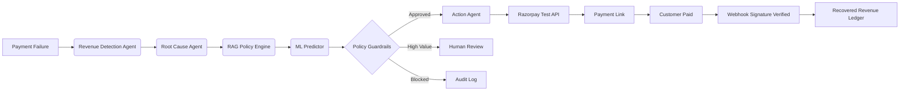

# RazorRecover AI

> **Autonomous AI Revenue Recovery Platform for Merchants**  
> *Built for Razorpay AI Buildathon 2026*

[](https://fastapi.tiangolo.com)
[](https://nextjs.org)
[](https://www.postgresql.org/)
[](https://razorpay.com)

---

## 1. Problem Statement
Indian merchants lose an estimated **15–28% of top-line digital revenue** to payment failures, checkout abandonment, and gateway degradation.

Standard merchant dashboards merely state:
> `"Payment Failed — ₹4,999"`

They fail to intelligently determine:
- **Why** the transaction failed (technical degradation vs. user friction vs. lack of funds).
- Whether the revenue is **recoverable** with high probability.
- What specific recovery action should be taken (smart retry vs. payment link vs. reminder).
- Whether the action complies with **deterministic merchant guardrails** (amount limits, max retry caps, fraud checks).
- Whether the recovery actually resulted in recovered funds.

---

## 2. The Solution: RazorRecover AI
**RazorRecover AI** is an autonomous multi-agent revenue recovery engine operating on behalf of the merchant. It converts passive failure monitoring into active revenue recovery.

```
DETECT ➔ UNDERSTAND ➔ PREDICT ➔ DECIDE ➔ VALIDATE ➔ ACT ➔ VERIFY ➔ MEASURE
```

1. **Detects** payment failures and anomalies in real-time.
2. **Investigates** root cause using contextual reasoning and network anomaly indicators.
3. **Retrieves** merchant policies using RAG.
4. **Predicts** recovery probability using an ML scoring layer.
5. **Validates** all proposed actions via a deterministic Policy/Guardrail engine.
6. **Executes** approved recovery via Razorpay Test Mode Payment Links.
7. **Captures** inbound webhooks with cryptographic HMAC signature verification.
8. **Records** an immutable audit trail for full compliance.

---

## 3. Architecture & Multi-Agent Design



### Core Agents:
- **Revenue Detection Agent**: Continuously identifies revenue leakage and transaction failures.
- **Root Cause Agent**: Diagnoses failure codes against live bank degradation telemetry.
- **RAG Policy Retriever**: Fetches merchant business rules and threshold guidelines.
- **ML Risk/Recovery Predictor**: Generates a 0.0–1.0 probability of successful recovery.
- **Deterministic Guardrail Engine**: Enforces strict financial limits before any API call.
- **Action Execution Agent**: Dispatches actions strictly to Razorpay Test Mode APIs.
- **Webhook Verifier**: Validates signatures and idempotently captures recoveries.

---

## 4. Deterministic Guardrails & Safety Matrix

| Guardrail Rule | Autonomous Limit | Breach Action |
| :--- | :--- | :--- |
| **Max Transaction Amount** | `<= ₹25,000` | Requires Human Admin Approval |
| **Maximum Retries** | `<= 2 retries` | Strictly `BLOCKED` |
| **Customer Fraud Risk** | `< 0.65` | `BLOCKED` if > 0.85, else Human Review |
| **Maximum Incentive Discount** | `<= 10%` | Requires Finance Approval |
| **Non-Retryable Codes** | `insufficient_funds`, `card_stolen` | Immediate retries blocked |

---

## 5. Technology Stack

- **Backend**: Python 3.12+, FastAPI, SQLAlchemy, Alembic, Pydantic v2, aiosqlite / asyncpg, PostgreSQL with pgvector, Redis, httpx.
- **Frontend**: Next.js 14, React 18, TypeScript, Tailwind CSS, Framer Motion, Recharts, Lucide Icons, TanStack Query.
- **Payments**: Razorpay Test Mode API & Webhooks.
- **Infrastructure**: Docker, Docker Compose.

---

## 6. Repository Structure

```
razorrecover-ai/
├── backend/
│   ├── app/
│   │   ├── api/v1/          # REST API endpoints (Dashboard, Txns, Recovery, Audit, Agents, Evaluation, Webhooks)
│   │   ├── core/            # Config, Database engine, Structured Logging
│   │   ├── models/          # SQLAlchemy relational models (Merchant, Customer, Transaction, Risk, Action, Audit, Policy)
│   │   ├── schemas/         # Pydantic validation schemas
│   │   ├── services/        # Business logic & telemetry aggregators
│   │   ├── policies/        # Deterministic PolicyEngine guardrails
│   │   ├── integrations/    # Razorpay Test Mode client
│   │   └── main.py          # FastAPI application entry point
│   ├── tests/               # Pytest automated test suite
│   ├── Dockerfile
│   └── requirements.txt
├── frontend/
│   ├── app/                 # Next.js App Router pages (Dashboard, Transactions, Detail, Recovery, Audit, Agents, Evaluation)
│   ├── components/          # FinTech design system components & Framer Motion timeline
│   ├── lib/                 # API client with resilient mock fallback
│   ├── types/               # TypeScript interfaces
│   └── package.json
├── data/
│   ├── synthetic/           # Synthetic dataset generator (~10k records)
│   ├── seed/                # Database seed runner
│   └── policies/            # Markdown policies for RAG
├── docs/                    # Architecture diagrams & demo guides
├── docker-compose.yml
├── .env.example
└── README.md
```

---

## 7. Quickstart & Local Setup

### Prerequisites
- Python 3.10+
- Node.js 18+ & npm

### 1. Clone & Configure Environment
```bash
cp .env.example .env
```

### 2. Run Backend
```bash
cd backend
pip install -r requirements.txt
uvicorn app.main:app --host 0.0.0.0 --port 8000 --reload
```
API Documentation will be available at: `http://localhost:8000/docs`

### 3. Seed Database with Synthetic Data
```bash
python scripts/seed_db.py --sample-size 250
```

### 4. Run Frontend
```bash
cd frontend
npm install
npm run dev
```
Merchant Dashboard will be live at: `http://localhost:3000`

---

## 8. Docker Compose Setup

Run the full stack with a single command:
```bash
docker compose up --build
```
- Frontend: `http://localhost:3000`
- Backend API: `http://localhost:8000`
- PostgreSQL: `localhost:5432`
- Redis: `localhost:6379`

---

## 9. Primary Demo Flow

1. Open `http://localhost:3000/dashboard` and observe the **₹2,84,210 Revenue At Risk** and active **UPI degradation anomaly**.
2. Click **"Investigate Failed ₹4,999"** to open transaction `txn_4999_upi`.
3. Inspect the **AI Investigation Card** showing 91% confidence root cause, evidence indicators, and passed policy guardrails.
4. Click **"Execute AI Recovery"** to watch the animated multi-agent timeline dispatch a Razorpay Test Mode Payment Link.
5. Review the immutable entry in the **Audit Trail** (`/audit`) and telemetry in **Agents** (`/agents`).
