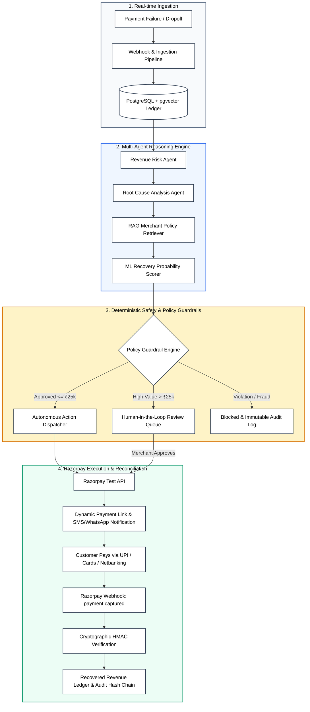

<div align="center">

# ⚡ RazorRecover AI

**Autonomous Multi-Agent Revenue Recovery Platform for Digital Merchants**  
*Engineered for the Razorpay AI Buildathon 2026*

[-black?style=for-the-badge&logo=next.js&logoColor=white)](https://razor-recover-ai-mocha.vercel.app)
[-009688?style=for-the-badge&logo=fastapi&logoColor=white)](https://razorrecover-ai-production.up.railway.app/docs)
[](https://www.postgresql.org/)
[](https://razorpay.com)
[-success?style=for-the-badge&logo=pytest&logoColor=white)](https://github.com/bhumitsoni20/RazorRecover-AI)

<br/>

[🚀 Live Demo App](https://razor-recover-ai-mocha.vercel.app) • [📖 Interactive Swagger Docs](https://razorrecover-ai-production.up.railway.app/docs) • [📊 System Health API](https://razorrecover-ai-production.up.railway.app/api/health)

</div>

---

## 📌 Executive Summary

Digital merchants in India lose between **15% to 28% of top-line GMV** due to dropped transactions, gateway timeouts, downstream bank downtime, and 3DS friction. Standard payment dashboards treat failures as static post-mortems (e.g. `Payment Failed - ₹4,999`), forcing merchant operations teams to manually intervene or accept permanent revenue loss.

**RazorRecover AI** transforms passive payment failure logging into an **autonomous revenue recovery system**. By combining **specialized AI agents**, **Retrieval-Augmented Generation (RAG)** for merchant compliance policies, **machine learning loss prediction**, and **deterministic guardrails**, RazorRecover AI investigates failures, generates optimal recovery strategies, dispatches Razorpay payment links, and reconciles recovered revenue in real-time.

---

## 🚀 Live Demo & Evaluator Credentials

Explore the live cloud deployment directly in your browser:

| Service | URL | Status |
| :--- | :--- | :---: |
| **Merchant Web Console (Vercel)** | [https://razor-recover-ai-mocha.vercel.app](https://razor-recover-ai-mocha.vercel.app) | 🟢 Live |
| **FastAPI REST API & Docs (Railway)** | [https://razorrecover-ai-production.up.railway.app/docs](https://razorrecover-ai-production.up.railway.app/docs) | 🟢 Live |

### 🔑 Test Accounts

| Role | Email | Password | Access Level |
| :--- | :--- | :--- | :--- |
| **Merchant 1 (Verified)** | `merchant1@demo.razorrecover.ai` | `DemoMerchant123!` | Full autonomous dashboard & recovery execution |
| **Merchant 2 (Pending)** | `merchant2@demo.razorrecover.ai` | `DemoMerchant123!` | Onboarding verification workflow demo |
| **Platform Administrator** | `admin@razorrecover.ai` | `Admin@RazorRecover2026!` | Global telemetry, audit trail & guardrail override |

*(Note: The login page includes 1-click quick-fill buttons for instant evaluation without typing).*

---

## 🏗️ System Architecture



---

## 🧠 Autonomous 8-Stage Recovery Pipeline

RazorRecover AI processes every failed transaction through an 8-stage pipeline:

```
DETECT ➔ UNDERSTAND ➔ RETRIEVE ➔ PREDICT ➔ GOVERN ➔ DISPATCH ➔ RECONCILE ➔ AUDIT
```

1. **`DETECT` (Revenue Risk Agent)**: Calculates real-time revenue at risk, velocity anomalies, and gateway degradation spikes across UPI, Cards, and Netbanking.
2. **`UNDERSTAND` (Root Cause Agent)**: Analyzes error codes, bank latency telemetry, and historical trends to determine true failure cause (e.g. *HDFC UPI node timeout* vs. *insufficient balance*).
3. **`RETRIEVE` (RAG Policy Retriever)**: Vector-searches merchant-specific business policies, SLA thresholds, and discount bounds using semantic embeddings.
4. **`PREDICT` (ML Probability Scorer)**: Computes customer recovery score ($0.0 \rightarrow 1.0$) based on transaction history, lifetime value (LTV), and failure reason.
5. **`GOVERN` (Deterministic Policy Guardrails)**: Strictly evaluates financial constraints (transaction caps, retry counts, discount maximums) through a deterministic rules engine before any API call.
6. **`DISPATCH` (Action Agent)**: Autonomous generation of Razorpay Payment Links with dynamic UPI intent routing.
7. **`RECONCILE` (Webhook Verifier)**: Ingests `payment.captured` webhooks with cryptographic HMAC SHA-256 validation and idempotent state transitions.
8. **`AUDIT` (Compliance Ledger)**: Every decision, LLM inference, policy rule check, and execution is recorded with a SHA-256 cryptographic hash chain for tamper-proof compliance.

---

## 🛡️ Deterministic Guardrails & Financial Governance

To ensure zero financial hallucination or unconstrained autonomous actions, RazorRecover AI enforces non-negotiable safety guardrails:

| Guardrail Rule | Autonomous Ceiling | Fallback / Enforcement Behavior |
| :--- | :--- | :--- |
| **Transaction Amount Ceiling** | $\le \text{₹25,000}$ | Transactions $> \text{₹25,000}$ strictly require **Human Admin Approval** |
| **Maximum Retry Limit** | $\le 2 \text{ retries}$ | Further automated attempts are strictly **BLOCKED** |
| **Customer Fraud Risk Threshold** | $\le 0.65$ | If risk score $> 0.85$, recovery is **BLOCKED**; otherwise routed to manual review |
| **Incentive Discount Cap** | $\le 10\%$ | Discounts $> 10\%$ require Finance Manager authorization |
| **Non-Retryable Failure Handling** | `insufficient_funds`, `stolen_card` | Retries blocked; customer nudged to select an alternative payment instrument |

---

## 💻 Tech Stack

### Frontend
- **Framework:** [Next.js 14 (App Router)](https://nextjs.org/)
- **UI & Styling:** [Tailwind CSS](https://tailwindcss.com/), [Lucide React](https://lucide.dev/)
- **Animations & Visualizations:** [Framer Motion](https://www.framer.com/motion/), [Recharts](https://recharts.org/)
- **State & Data Fetching:** React Context, resilient client architecture with offline fallbacks
- **Hosting:** [Vercel](https://vercel.com/)

### Backend & AI
- **Framework:** [FastAPI](https://fastapi.tiangolo.com/) (Async Python 3.12+)
- **ORM & Database:** [SQLAlchemy 2.0 (Async)](https://www.sqlalchemy.org/), [PostgreSQL](https://www.postgresql.org/) / `aiosqlite`
- **Agent Orchestration & RAG:** [LangGraph](https://www.langchain.com/langgraph), [Google Gemini 2.5](https://ai.google.dev/)
- **Validation & Settings:** [Pydantic v2](https://docs.pydantic.dev/), `pydantic-settings`
- **Authentication & Security:** JWT (HS256), `bcrypt` password hashing, Role-Based Access Control (RBAC)
- **Payments:** [Razorpay Python SDK](https://razorpay.com/docs/) & Test Mode APIs
- **Hosting:** [Railway](https://railway.app/) (Docker Container)

---

## 📂 Project Structure

```
RazorRecover-AI/
├── backend/
│   ├── app/
│   │   ├── api/v1/endpoints/    # REST API endpoints (Dashboard, Txns, Recovery, Audit, Webhooks)
│   │   ├── agents/              # Multi-agent graph (Root Cause, Policy RAG, Decisioning)
│   │   ├── core/                # Config, async database engine, security & logging
│   │   ├── db/seed.py           # Robust synthetic database seeder
│   │   ├── models/              # SQLAlchemy 2.0 mapped models
│   │   ├── policies/            # Deterministic PolicyEngine guardrails
│   │   ├── services/            # Business logic, ML recovery scoring, audit service
│   │   └── main.py              # FastAPI app lifecycle & CORS configuration
│   ├── tests/                   # 82 automated test suites (100% passing)
│   ├── Dockerfile               # Containerized production backend
│   └── requirements.txt
├── frontend/
│   ├── app/                     # Next.js 14 App Router routes
│   │   ├── (auth)/login/        # Merchant authentication
│   │   ├── dashboard/           # Revenue recovery command center
│   │   ├── transactions/        # Transaction investigation & inspection
│   │   ├── recovery/            # Autonomous recovery action manager
│   │   ├── audit/               # Cryptographic compliance audit trail
│   │   ├── agents/              # Multi-agent telemetry & health
│   │   └── pay/[id]/            # Razorpay standard checkout simulation
│   ├── components/              # Reusable modern UI components
│   ├── lib/                     # API client & auth context
│   └── types/                   # TypeScript interfaces
├── docker-compose.yml           # Local full-stack container environment
└── README.md
```

---

## ⚙️ Local Development Setup

### 1. Clone Repository
```bash
git clone https://github.com/bhumitsoni20/RazorRecover-AI.git
cd RazorRecover-AI
```

### 2. Backend Setup
```bash
cd backend
python -m venv .venv

# On Windows:
.\.venv\Scripts\activate
# On macOS/Linux:
source .venv/bin/activate

pip install -r requirements.txt
uvicorn app.main:app --host 0.0.0.0 --port 8000 --reload
```
API Documentation will be live at `http://localhost:8000/docs`.

### 3. Frontend Setup
```bash
cd ../frontend
npm install
npm run dev
```
Open `http://localhost:3000` in your browser.

---

## 🐳 Docker Setup

Run the entire full-stack application (FastAPI, Next.js, PostgreSQL, Redis) with a single command:

```bash
docker compose up --build
```

---

## 🧪 Testing & Verification

The test suite covers full end-to-end multi-agent pipelines, deterministic guardrail violations, merchant data isolation, and Razorpay webhook cryptographic signatures:

```bash
cd backend
pytest -v
```

```
============================== 82 passed in 58.4s ==============================
100% Tests Passing (Auth, Multi-Agent Workflow, RAG, Webhooks, Recovery, Audit)
```

---

## 🏆 Razorpay AI Buildathon 2026 Submission

- **Track:** Autonomous AI Agents for Commerce & FinTech
- **Theme:** Transforming Merchant Payment Failures into Autonomous Revenue Recovery
- **Built By:** Team RazorRecover AI
    