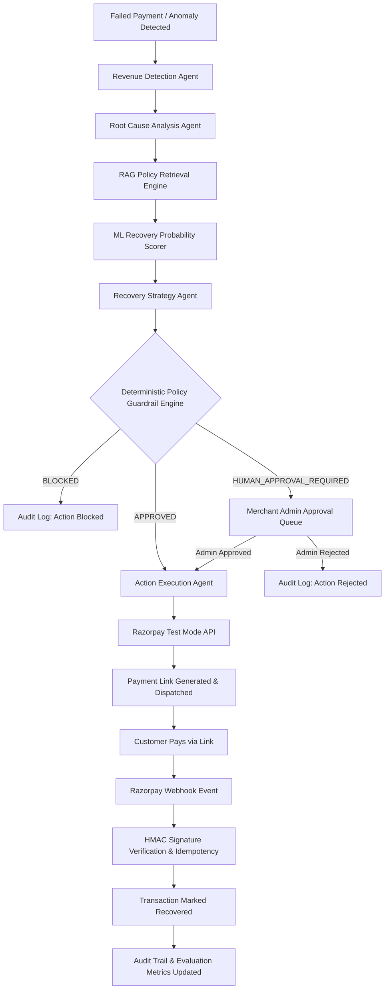

# RazorRecover AI — Technical Architecture & Multi-Agent Design

## 1. Executive Summary
RazorRecover AI is an autonomous AI revenue recovery platform designed for merchants using Razorpay payment infrastructure. Unlike standard failure alert dashboards, RazorRecover AI autonomously investigates root causes (e.g. UPI degradation, bank 3DS timeouts, session dropouts), predicts recovery probability using an ML scoring layer, retrieves merchant policies using RAG, verifies actions through a deterministic policy guardrail engine, executes actions via Razorpay Test Mode APIs (Payment Links), and verifies outcomes via cryptographic webhooks.

---

## 2. End-to-End System Flowchart

---

## 3. Multi-Agent System Roles & Isolation

| Agent / Engine | Purpose | Output & Artifacts |
| :--- | :--- | :--- |
| **Revenue Detection Agent** | Scans live transaction streams, PSP latencies, and checkout sessions for recoverable leakage. | Risk Score (0-1), Detected Issue category. |
| **Root Cause Agent** | Correlates payment failure codes (`upi_timeout`, `bank_degraded`) with bank anomalies & historical customer success. | Root cause diagnosis & evidence array (e.g. +4.8x UPI failure spike). |
| **RAG Policy Retriever** | Searches merchant policy knowledge base for allowable retry caps, high-value rules, and discount limits. | Chunk references (e.g. §2.1 Payment Link Autonomous Rule). |
| **ML Probability Layer** | Computes conditional recovery probability based on customer LTV, failure type, and time-of-day degradation. | Recovery Probability (0-1) & Expected Recovery (₹). |
| **Policy Guardrail Engine** | Deterministic rule validator. Prevents LLMs from executing unauthorized financial operations. | Verdict: `APPROVED`, `HUMAN_APPROVAL_REQUIRED`, `BLOCKED`. |
| **Action Execution Agent** | Interacts strictly with Razorpay Test Mode APIs upon verified policy approval. | Payment link URL, short code, external reference ID. |
| **Webhook Verifier Service** | Validates inbound webhook signatures (`X-Razorpay-Signature`) and ensures idempotent recovery capture. | Immutable Audit record, recovery ledger update. |

---

## 4. Deterministic Guardrails & Safety Matrix

Non-deterministic LLM reasoning is decoupled from financial execution:

1. **Amount Limit**: Any recovery action > ₹25,000 automatically transitions to `HUMAN_APPROVAL_REQUIRED`.
2. **Retry Cap**: Maximum 2 automated retries per transaction; attempt #3 is strictly `BLOCKED`.
3. **Fraud Guard**: Customer risk score > 0.65 flags for manual review; > 0.85 is strictly `BLOCKED`.
4. **Discount Ceiling**: Maximum 10% autonomous discount incentive.
